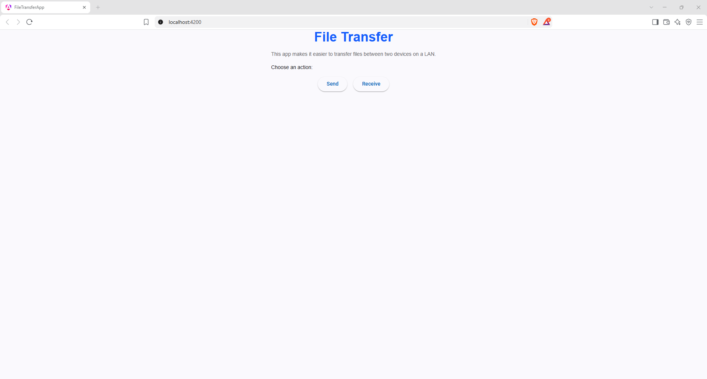
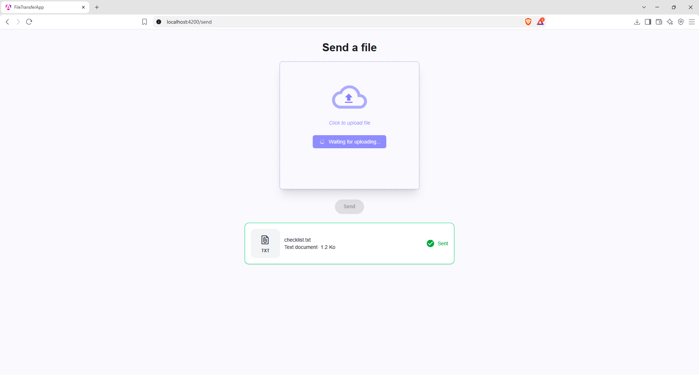
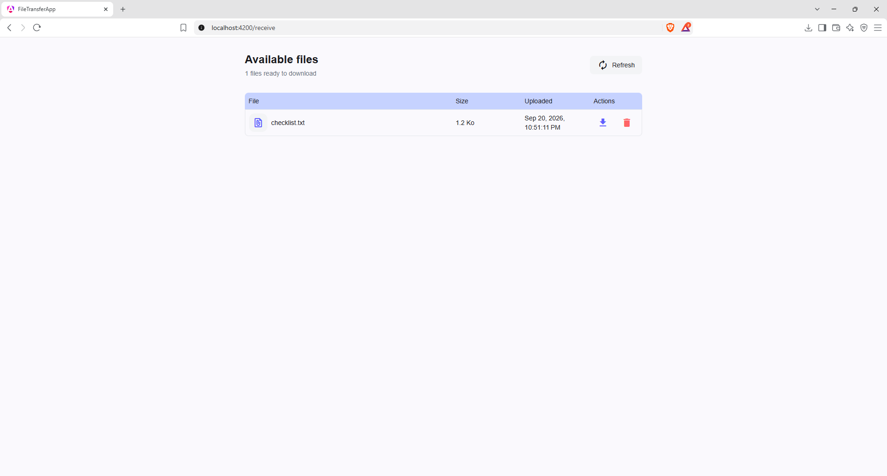
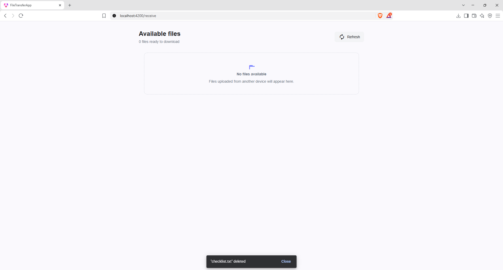

# File-Transfer

**File-Transfer lets you move files between your devices (PC ↔ PC, PC ↔ phone) over your local Wi-Fi network — no cloud, no account, and nothing to install on the receiving device: it just needs a browser.**

Built with **Angular** (frontend) and **Spring Boot** (backend).

## What it does / What it doesn't do

**What it does (current MVP):**

- **Send** a file from any device on the network
- **List** every available file
- **Download** any file to any device
- **Delete** a file (with a confirmation prompt)

**Current limitations:**

- **Local network only** — every device must be on the same Wi-Fi network or mobile hotspot (no Internet transfer)
- **10 MB maximum per file** — larger files are rejected
- **One device must run the application** (the "main device"); the others only need a browser
- **Shared file list** — every connected device sees every uploaded file

## How it works

One device — the **main device** — runs the application (backend + frontend). Every other device on the **same Wi-Fi network** opens the app in a **browser** using the main device's local IP address. Files uploaded from any device are stored on the main device and appear in a shared list visible to all connected devices.

## Prerequisites

Only the **main device** (the one running the application) needs the tools below. **Client devices only need a recent web browser** (Chrome, Edge, Firefox, or Safari) — nothing to install.

To simply run the app you need **Java** and **Node.js**. The other tools (Maven, Angular CLI, IntelliJ IDEA) are only useful for development — Maven and the Angular CLI already ship through the project's wrappers.

Versions listed are the ones validated on the reference machine.

| Tool           | Version          | Download                                                           |
|----------------|------------------|--------------------------------------------------------------------|
| Java (JDK)     | 21.0.12 (Temurin)| https://adoptium.net/temurin/releases/?version=21                  |
| Maven          | 3.9.16           | https://maven.apache.org/download.cgi                              |
| Node.js        | 24.19.0          | https://nodejs.org/en/download                                     |
| npm            | 11.17.0          | Bundled with Node.js                                               |
| Angular CLI    | 22.1.4           | Install via npm (see below)                                        |
| IntelliJ IDEA  | 2026.2           | https://www.jetbrains.com/idea/download                            |
| Git            | 2.40+            | https://git-scm.com/downloads                                      |

### Install Angular CLI

Once Node.js is installed, open a terminal and run:

```
npm install -g @angular/cli
```
## Verify your installation

Open a new terminal and run the following commands. Each should return a version number.

```
java -version
mvn -v
node -v
npm -v
git --version
```

Expected output (versions may vary slightly):

- `java -version` → `openjdk 21.0.12` or higher
- `mvn -v` → `Apache Maven 3.9.16` or higher
- `node -v` → `v24.19.0` or compatible (20.19+, 22.12+, or 24.x)
- `npm -v` → `11.17.0` or higher
- `ng version` → `Angular CLI: 22.1.4` or higher
- `git --version` → `git version 2.40` or higher

If any command returns "command not found" (or "n'est pas reconnu" / "ist entweder falsch geschrieben"), the tool is either not installed or missing from your system PATH.

> To check the Angular CLI, first move into the frontend folder — `cd frontend/file-transfer-app` — then run `ng version` (expected `Angular CLI: 22.1.4` or higher).

## Get the project

### 1. Clone the repository

Open a terminal in the folder where you want to store the project, then run:

```
git clone https://github.com/Team-Kmer/File-Transfer.git
cd File-Transfer
```

### 2. Open the project in IntelliJ IDEA

1. Launch IntelliJ IDEA.
2. Click **File > Open** (or **Open** on the welcome screen).
3. Select the `File-Transfer` folder you just cloned.
4. Wait for IntelliJ to index the project and download dependencies. This may take a few minutes on the first opening.

### 3. Project structure

```
File-Transfer/
├── backend/      # Spring Boot application (Java 21)
├── frontend/     # Angular application
├── CONTRIBUTING.md
├── LICENSE
└── README.md
```

## Running the application on two machines

The application can be tested with two physical machines connected to the same
Wi-Fi network or mobile hotspot.

- Machine A runs the backend and the Angular development server.
- Machine B accesses the application through Machine A's local IPv4 address.
- No IP address must be changed in the source code.

### Windows setup on Machine A

Open PowerShell in the project root and run:

```powershell
ipconfig
```

Find the **`IPv4 Address`** under your active Wi-Fi adapter, e.g. `192.168.1.10`. Use this address as Machine A's IP (`<MACHINE_A_IP>`) in the commands below.

#### Start the backend

In the same PowerShell terminal:

```powershell
cd backend

$env:SERVER_ADDRESS = "0.0.0.0"
$env:APP_CORS_LAN_ORIGIN = "http://<MACHINE_A_IP>:4200"

.\mvnw.cmd spring-boot:run
```

The backend listens on every network interface on port `8080`.

#### Start the frontend

Open another PowerShell terminal in the project root:

```powershell
cd frontend/file-transfer-app
npm install
npm start -- --host 0.0.0.0
```

The Angular development server listens on every network interface on port
`4200`.

The terminal displays a network URL similar to:

```text
http://192.168.1.10:4200
```

### macOS / Linux setup on Machine A

Find the local IP address:

```bash
# macOS (en0 is usually Wi-Fi; try en1 if the result is empty)
ipconfig getifaddr en0

# Linux (take the first address shown)
hostname -I
```

Start the backend (first terminal, project root):

```bash
cd backend
export SERVER_ADDRESS=0.0.0.0
export APP_CORS_LAN_ORIGIN="http://<MACHINE_A_IP>:4200"
./mvnw spring-boot:run
```

Start the frontend (second terminal, project root):

```bash
cd frontend/file-transfer-app
npm install
npm start -- --host 0.0.0.0
```

### Connect from Machine B

Machine B must be connected to the same Wi-Fi network or mobile hotspot as
Machine A.

Open the network URL displayed by the Angular development server:

```text
http://<MACHINE_A_IP>:4200
```

Do not use `localhost` on Machine B. On Machine B, `localhost` refers to
Machine B itself.

The frontend automatically contacts the backend through the hostname used in
the browser. No backend IP address needs to be configured in the frontend
source code.

### Windows Firewall

If Machine B cannot reach ports `4200` or `8080`, open PowerShell as
Administrator on Machine A:

```powershell
New-NetFirewallRule `
  -DisplayName "File Transfer Frontend" `
  -Direction Inbound `
  -Action Allow `
  -Protocol TCP `
  -LocalPort 4200 `
  -RemoteAddress LocalSubnet

New-NetFirewallRule `
  -DisplayName "File Transfer Backend" `
  -Direction Inbound `
  -Action Allow `
  -Protocol TCP `
  -LocalPort 8080 `
  -RemoteAddress LocalSubnet
```

These rules only allow machines located on the local subnet.

Third-party security software, such as ESET, may have its own firewall. Its
rules must also allow incoming TCP connections on ports `4200` and `8080`.

### Connectivity checks

On Machine B, use PowerShell to check both ports:

```powershell
Test-NetConnection <MACHINE_A_IP> -Port 4200
Test-NetConnection <MACHINE_A_IP> -Port 8080
```

Both commands should display:

```text
TcpTestSucceeded : True
```

### Manual acceptance test

Perform the following test from Machine B:

1. Open `http://<MACHINE_A_IP>:4200`.
2. Upload an image file.
3. Upload a PDF file.
4. Upload a text file.
5. Upload a file close to, but not larger than, 10 MB.
6. Verify that every file appears in the file list.
7. Download the files and verify that they can still be opened.
8. Repeat the verification from Machine A.

The current MVP uses a shared file list. Therefore, Machine A and Machine B
both see every uploaded file, including files uploaded from the same machine.

Files larger than 10 MB are expected to be rejected.

## User guide — send from device A, download / delete from device B

Open the app (`http://<MACHINE_A_IP>:4200`). The **Home** screen offers two actions, **Send** and **Receive**:



**On device A** — click **Send**, choose a file (≤ 10 MB), then click **Send**:



**On device B** — click **Receive**. The file appears in the **Available files** list, each row offering a **download** and a **delete** action:



Click the **download** icon to save the file on device B. Click the **delete** (trash) icon to remove it — a **"Delete file?"** prompt appears first, and a confirmation is shown once the file is deleted:



> Because the MVP uses a shared file list, both devices see every uploaded file, including files uploaded from the same device.

## Troubleshooting

### "localhost refuses to connect" when opening the app

The servers are not running yet, or have not finished starting. Make sure **both** terminals (backend and frontend) are running, and wait until Angular prints its network URL. On any device other than the main one, use `http://<MACHINE_A_IP>:4200`, never `localhost`.

### The other device cannot access the application

Make sure **both devices are on the same Wi-Fi network** (or mobile hotspot), that the frontend was started with `--host 0.0.0.0`, and that ports `4200` and `8080` are **allowed by the firewall** (see the firewall rules above). Public, guest, hotel, or university Wi-Fi often blocks device-to-device traffic — use a private network or a mobile hotspot.

### "File too large" message

The file exceeds the **10 MB** limit enforced by the backend. Send a file of 10 MB or less — this is a current MVP limitation.

### Upload is very slow or stuck

This is usually a weak Wi-Fi signal, a file close to the 10 MB limit, or the backend restarting. Move closer to the router, retry with a smaller file, and check the backend terminal for errors.

### The Angular page is not reachable

Make sure Angular was started with:

```powershell
npm start -- --host 0.0.0.0
```

Check that port `4200` is allowed by Windows Firewall and by any third-party
firewall.

### The frontend opens, but backend requests fail

Check port `8080` from Machine B:

```powershell
Test-NetConnection <MACHINE_A_IP> -Port 8080
```

Make sure the backend was started with:

```powershell
$env:SERVER_ADDRESS = "0.0.0.0"
```

### A CORS error appears in the browser

Make sure the configured CORS origin contains the exact protocol, IP address,
and frontend port:

```powershell
$env:APP_CORS_LAN_ORIGIN = "http://<MACHINE_A_IP>:4200"
```

Restart the backend after changing this environment variable.

### Ping works, but the TCP connection fails

This normally indicates a firewall problem. Check Windows Firewall and any
third-party security software installed on Machine A.

### Both machines use the same Wi-Fi, but cannot communicate

Some public, university, hotel, or guest Wi-Fi networks enable client
isolation. Connect both machines to a private Wi-Fi network or to the same
mobile hotspot.

### The application stopped working after reconnecting to Wi-Fi

Machine A may have received a different IP address. Restart both servers using
the IP detection procedure and use the new network URL on Machine B.

## Contributing

Interested in contributing? See [CONTRIBUTING.md](CONTRIBUTING.md).